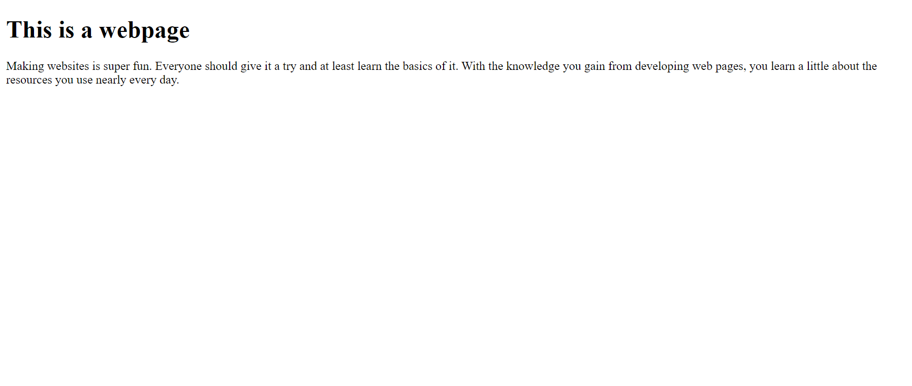

# UI Design
Have you ever seen a webpage that looks like this:

This is a webpage, and a rather basic one at it. Many people who peruse the web rarely see a webpage that looks like this because people who develop webpages usually have standards for themselves. Webpages are known to look much better than this and have much more color, style, attitude, and pazzazz. Take [Google.com](google.com) for example. This webpage is often a simple webpage but on rather frequent occasions becomes a digital mural to some day, person, or event. This is what is known as UI design. A user-interface design, made to interact with the user. However, if you've ever tried to make a webpage yourself, a simple website like the Google has made famous is not necessarily a simple task.

# Webpage Design

Anyone who's worked on UI design know that it's a little complicated in the beginning. Starting off with the basic html framework, the development of a webpage is a neat and simple process. However, the process doesn't end with a world class multi-million dollar company webpage. Your first webpage most likely looks like the one illustrated above, black text on a white background. It's not until css code is integrated until aspects like color, size, borders, shapes, and the more intricate formatting comes into play. The application of the css code into a webpage gives it a lot more personality while helping organize the website in the process.

# UI Frameworks

If you wanna make a website on the level of a professional, the next step is most likely integrating a UI framework into the website. The UI framework is a set of classes and subsystems that will help organize the webpage. It facilitates many structures that are common among many websites. A good first base to UI frameworks is definitely [Semantic-UI](https://semantic-ui.com/). This UI framework is a simple class based framework that can be used to replicate many of the structures that can be seen throughout the internet. Even this webpage is made with Semantic UI.
  Semantic UI can do some amazing things with the simplest of integration. With a class system that is based on English and not some fancy programing jargon, the framework is simple to grasp and can even, though no professional would recommend it, guessed through.

Let's show an example. Here are four images that use the Semantic UI framework with multiple classes. The image to the right is a medium sized UI image floated to the right of the screen.

The image below is a tiny UI image made into the icon of a profile.

Cow

The image below is a fluid UI image which will take up as much horizontal space as it is provided.

The last image is a circular UI image centered to the screen and made to a small size.

