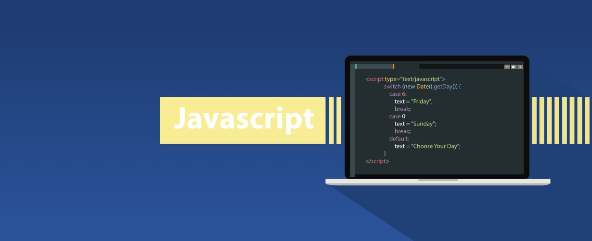

# Why Javascript for Web Development
Javascript is a programming language that made its debut in [December 1995](https://web.archive.org/web/20070916144913/http://wp.netscape.com/newsref/pr/newsrelease67.html). From that date, Javascript has grown to become a well known programming language world wide. With my limited language of programming languages, I can safely say that Javascript is powerful. The capabilities that Javascript provides both developer and user are immense. Not only is the language powerful but also fast, versatile, accessible, and most importantly simple.

# Javascript is fast
Although many programming languages can be considered fast, many aren't as quick to pick up and learn as Javascript. With Javascript being able to be run on through online development softwares such as [JSFiddle](https://jsfiddle.net/), [PlayCode](https://playcode.io/), and [js.do](https://js.do/), the language is as accessible as a wifi connection. But having access to a Javascript development software is useless if you don't know what you're doing. Not only is the langauge easy to gain access to, it is also easy to learn.

# Javascript is simple
KISS is a common catch-phrase used among programmers. The acronym stands for, 'keep it simple stupid' and Javascript really embodies this mantra. Anyone could learn any programming language with enough time and effort. The problem that most face is the material itself. The amount of time and effort that is needed to learn other programming languages nearly quadruples the number of steps required to learn Javascript. With hundreds of resources available online to learn Javascript, the probability of you finding a medium that you prefer is high. [Code Camp Free](https://www.freecodecamp.org/) and [Developer Mozilla](https://developer.mozilla.org/en-US/docs/Web/JavaScript)are awesome website that can teach you Javascript and many other programming languages just on your browser for free. This resource alone will grant you a solid baseline for developing simple algorithms that look neat and understandable to other developers. 

# So Why Javascript?
With all the reasons liste above, it's understandable why Javascript is growing at a fast rate. With the many advantages that Javascript holds over other programming languages its no wonder its such a popular langauge. With hundreds of sources to learn Javascript from, many developing softwares readily available, and the lack of any clunky packages and installations, Javascript is bound to have a large base of beginner users who use Javascript as their introductory programming language.