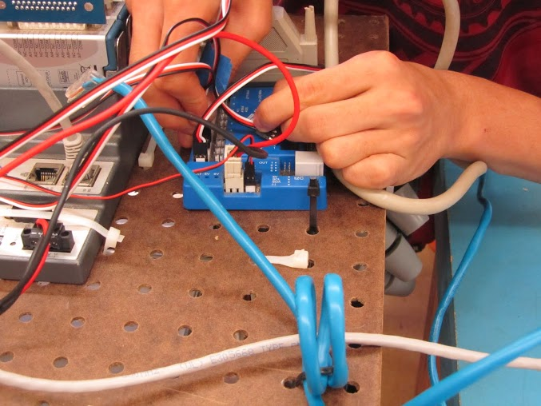

The First Robotics Competition is a seasonal robotics competition dedicated to providing students with a vehicle to help develop their life skills. This global neo-sport emphasizes not only the importance of the engineering design process but also self-confidence, communication, leadership, and most importantly gracious professionalism.

On this project, I was the lead of electronics and electrical systems. My responsibilities included developing and maintaining the electronics on board the robot, which included all the processors, power distribution devises, sensors, actuators, and power sources. Being of the most significant subsystem of the project, I collaborated with the leads from all the other subsystems to incorporate the electrical system into their work. This included maintaining proper power distribution to all actuators, I/O configuration, and sensor testing for accurate active measurements on board the robot.

For more information, visit the [First Robotics Competition website](https://www.firstinspires.org/about/vision-and-mission).
