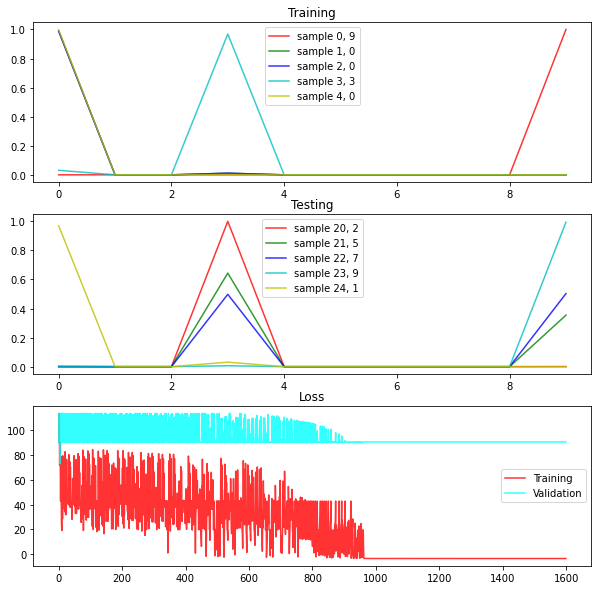
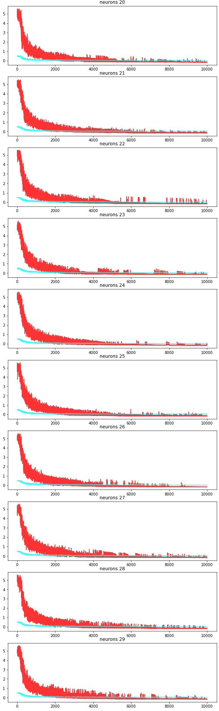
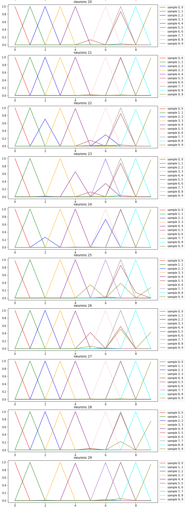

I created a neural nework from scratch. This neural network recognizes articles of clothing from the [fashion mnist dataset](http://fashion-mnist.s3-website.eu-central-1.amazonaws.com/). The significance of this simple neural network classifier is that it is constructed without the use of famous libraries such as Keras, Scikit Learn, Pytorch, etc.

# The Fashion MNIST Dataset
The MNIST Fashion dataset includes 70,000 samples of 28x28 grayscale images of clothing articles. Each of these samples are labeled as one of ten classes. The classes are as follows:

0 - T-shirt/top

1 - Trouser

2 - Pullover

3 - Dress

4 - Coat

5 - Sandal

6 - Shirt

7 - Sneaker

8 - Bag

9 - Ankle Boot

# The Neural Network
The simple neural network contained only one hidden layer. The input is a 784x1 array representing the pixels in a flattened sample image. This hidden layer has a size between 1 and 29 neurons. The hidden layer uses a relu function as it's non-linear function. This prevents the values of the weights from dipping below zero. The neural network outputs a 10x1 array which represented a set probabilities that the neural network uses as its prediction for the label of the sample. The output layer uses a softmax function to make sure the probabilities in the output all sum to one.

# Feature Engineering 
Before handing the dataset into the neural network, the data has to be flattened from a 28x28 grayscale image to a 784x1 array of number which represents the value of each pixel.

Of the 70,000 samples, 60,000 samples were used as a training set and the remaining 10,000 samples were considered the clean testing set. The clean testing set is important to analyze the neural network using data that it has never seen before. 

# Hyperparameter Optimization
The hyperparameters in a machine learning model are the set of numbers that can be changed to heighten the efficiency and quality of training within the model. The hyperparameters in the neural network include learning rate, batch size, max epochs, and hidden layer shape. Learning rate controls the magnitude of the weight adjustments for each epoch of training. The batch size determines the number of samples that the neural network trains on at a time. The max epochs determines the maximum number of times the neural network is trained. The hidden layer shape determines the number of neurons in the hidden layer. The learning rate was tuned between 0.01 and 1e-10 in intervals of a magnitude of 1/10. The batch size was tuned between 1 and 500 samples at a time in intervals of 10. The max epochs was tuned between 10 and 10000 epochs with intervals of 1000. The hidden layer shape was tuned between 1 and 29 neurons with intervals of 1.

The hyperparameters were optimized by hand, evaluating the cross entropy loss over time as the network trained. After trying each value for the hyperparameters, the best values were found. The best hyperparameters were found to be the following:
> Learning Rate: 1e-10

> Batch Size: 100

> Max Epochs: 6000

> Hidden Layer Shape: 25+

The learning rate of 1e-10 prevented the neural network from becoming unstable while training but allowed the weights to still be updated at a good enough pace to save time with epochs. The batch size turned out to be 100 simply because my system could not process any larger batch sizes. The best number of max epochs turned out to be 6000 as any epochs beyond that would not have a noticable effect on loss. Lastly, the number of hidden layers did not seem to significantly change the rate that the loss changed, but significantly increased the accuracy of the predictions as the number of neurons surpassed 25.

# Evaluation
The neural network was able to successfully classify the sample 96% of the time. However, I observed some patterns: 
> High rates of confusion between the sandal (5th) class and the sneaker (7th) class. They would often get swapped with a higher bias to predict a sandal over a sneaker. 

> Confusion between the pullovers (2nd) class, coats (4th) class, and shirts (6th) class. But the networks with greater neurons begin to grow a stronger capability of telling the difference between these two. 

> Extreme accuracy in all the other classes which could be seen as overfitting.
