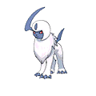
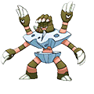
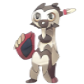
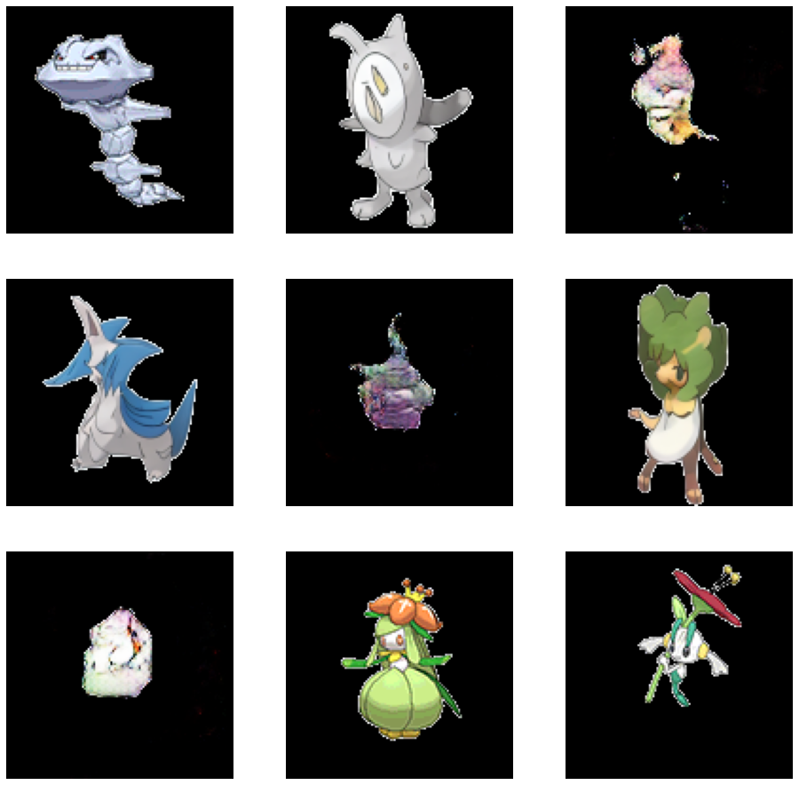

An innovation that has gotten loads of attention recently are neural networks that are capable of creating art. Probably the most famous example is OpenAI's [DALLE2](https://openai.com/dall-e-2/). It is fascinating to see that the advancement of machine learning technologies has advanced so much that they can be seen creating entirely original pieces of art. This project does something similar. The project attempts to create new pokemon that do not exist.

# Pokemon
[Pokemon](https://www.pokemon.com/us/), a Japanese video game famous for their unique looking monster creatures has amassed a following so large that many can recognize the hundreds of Pokemon by name. They have a very recognizable art style and seem to follow very little standards in terms of defining the design of a Pokemon.

# About the Neural Network
The neural network design that is capable of creating things like unique works of art or brand new Pokemon is known as a generative adversarial network (GAN). This model actually uses two neural networks to accomplish its goals. The first neural network is the one we are most interested in and is known as the generator. It's role in the model is to create the output, such as the art or Pokemon. The second network is known as the discriminator and although it is less noticeable to those who see the work of the generator, it is just as important. The discriminator determines if the image that is generated by the generator is an existing piece or a generated piece. By having these two networks compete against each other, they will both eventually become very good at doing what they are intended to do. That is where the term adversarial comes into play.

# My Network Structure
Each of the two neural networks were complex deep networks. The generator was constructed of three blocks of hidden layers. Each block is made of a 2D transpose layer followed by a batch normalizer and finally to a leaky relu before being handed to the next block. The generator took in an input layer of size 57,600x3 which represents the pixels flattened out and their colors in red, blue, green format. The pixels would then get fed through the model and outputted as a 120x120x3 image. 

The discriminator was constructed with two blocks of hidden layers. Each block containing a 2D convolution layer followed by a leaky relu and a dropout layer. The input of the 120x120x3 image and outputs only 1 value.

# Feature Engineering
Features in a neural network are the inputs that the neural network handles when training. The data I used was generated by this [Kaggle](https://www.kaggle.com/datasets/vishalsubbiah/pokemon-images-and-types?datasetId=92703&searchQuery=new+) competition. It includes 721 png files of unique pokemon, each centered and placed on an empty background. The data was entirely processed before I downloaded it, so I did not need to adjust it in anyway.

# Hyperparameter Optimization
The parameters used for these models were what I would consider unorthodox as far as machine learning models I have used in teh past. I had to tune the shape of the generator and discriminator a lot. I adjusted it by hand and it took me a while to get the generator to the correct shape so that it generated an image that was the same shape as the Pokemon images that I used in the training dataset. I also though I needed to tune the shape of the noise used for the input of the generator, but it ended up not mattering. The shape of the noise just affected the amount of time per epoch and the resolution of the output. To figure out the shape of the layers that would be used best in the generator and discriminator models, I referenced the code examples in the Keras documentation such as the [cyclegan example](https://keras.io/examples/generative/cyclegan/). After training the model for about 20,000 epochs, the model seemed to blow up, losing all resemblance to the images it was intended to emulate and returning a noisy blob.

# Evaluation
To evaluate the model I gathered some other images to generate some statistics to help define the fidelity of the generated Pokemon. I gathered a set of fake Pokemon and reshaped the images to match the 120x120 image space and deleted the background of teh images to make them indistinguishable from the Pokemon in the training dataset. I then generated three 3x3 panels of Pokemon, mixing in real, fake, and generated Pokemon randomly. I quizzed a few individuals asking them to classify each of the 27 Pokemon as real or fake. The level of Pokemon knowledge between these individuals ranged from only knowing Pikachu to knowing the number, type, weight, and height of most Pokemon. 

After the quizzes, it became obvious that even those who were unable to distinguish between real and fake Pokemon were still able to identify the generated Pokemon. The generator still had a fidelity too low to convince the participants. The puffs of rainbow smoke outputted by the generator is easily distinguishable and extremely overgeneralized in its colors. Although the silhouette does resemble that of the training dataset, the rest of the generated pokemon failed to convince.

> Real Pokemon: 100% everyone was able to identify the real Pokemon as real
> Fake Pokemon: 33% some people mistook the fake Pokemon for real Pokemon
> Generated Pokemon: 6% almost no one thought the generated Pokemon were real Pokemon

# In The Future
The generative model underperformed, only being able to generate silhouettes with the likeness of the Pokemon and not being able to organize the colors enough. The statistics show its shortcomings in comparison to similar models found on the internet, who were able to fool some of the quiz participants into believing they were real Pokemon.