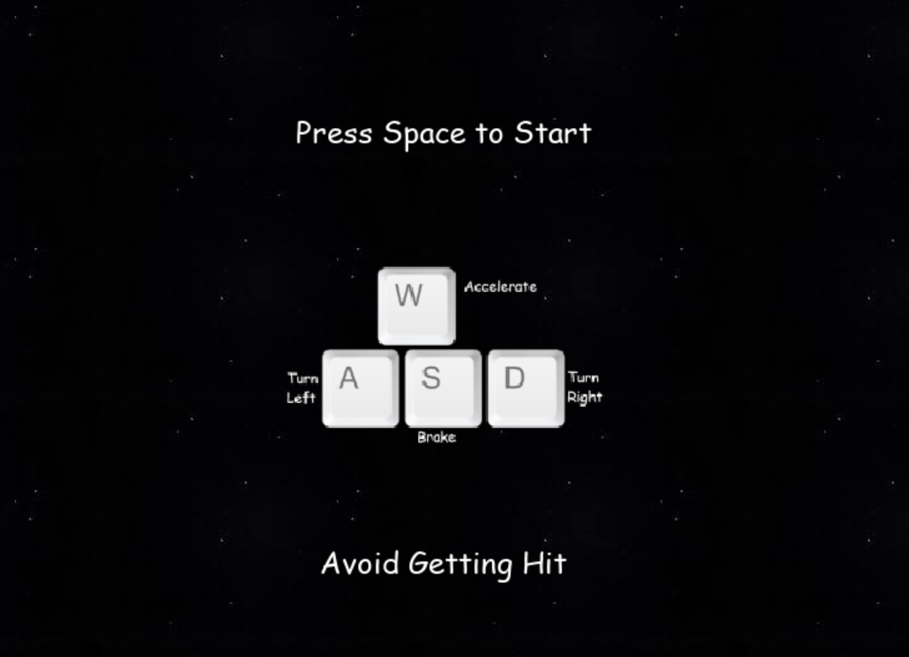
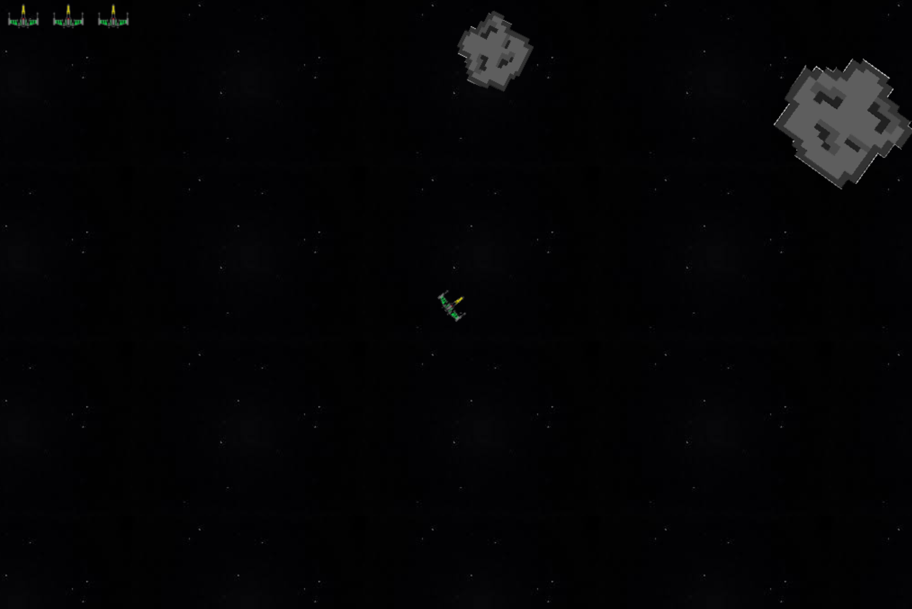
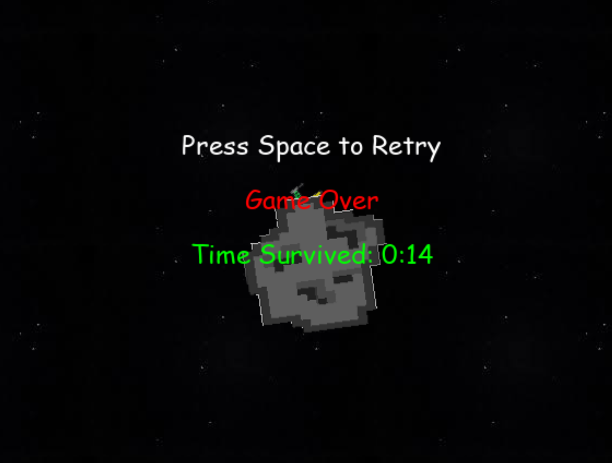

Space Runner is a very basic video game made using the python and the pygame api. The objective of the game is to dodge a storm of rocks that fly though space. The game has three phases, the introduction phase, the play phase, and the game over phase. 

The introduction phase is the phase that the game starts in. Once the executable is opened, the start screen appears, informing the player of the controls, objective, and start key. After the player presses the start key, the game enters the play phase. 

The play phase is when the space ship is placed on the window and the space rocks start making their way onto the field. The player needs to dodge the rocks and the game ends when they get hit three times. When the game ends, the game over phase is entered. 

In the game over phase, the player is informed of how long they stayed alive and the key to restart.

More information on pygame can be found [here](https://www.pygame.org/)
