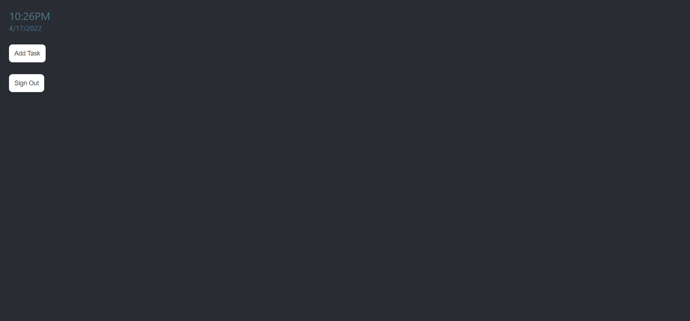
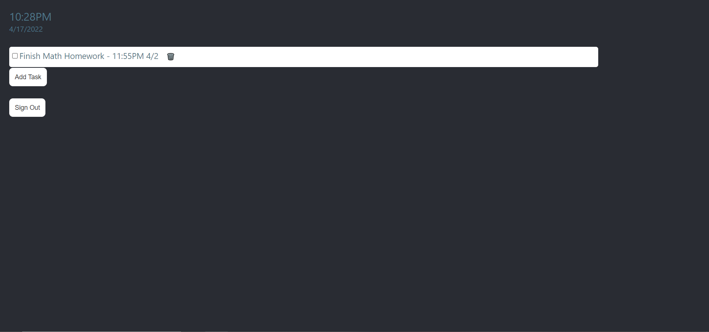
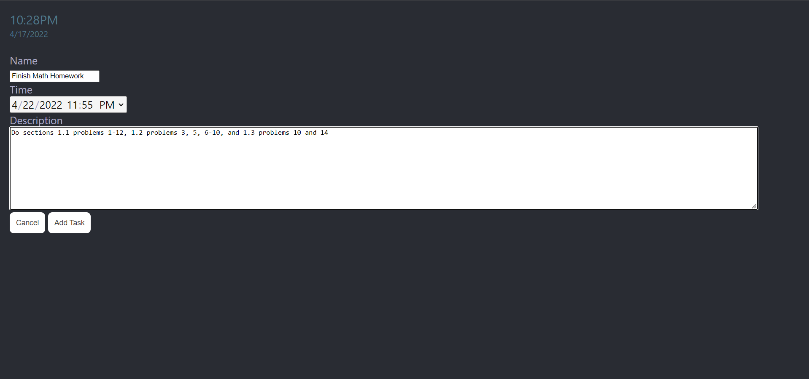
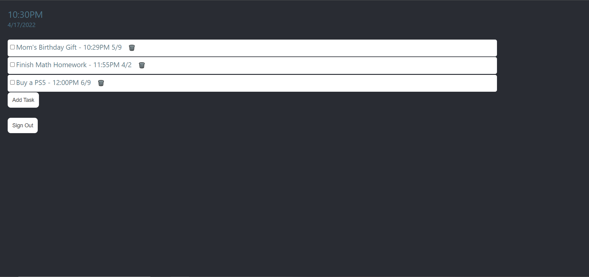

This to do list is a very basic application to test myself and practice some basic skills. I created this to practice my skills in ReactJS and to play around with Amazon Web Services a little. This project is the first of a set I plan to do in order to slowly teach myself to create large scale applications. Being the first, it is simple hand has a small scope.

This project tested my understanding of the basics of programming in Javascript, implementing libraries, solving problems, and debugging code while allowing me to practice some basic user interface and user experience design. With this project I attempted to use as few open source libraries as possible. The few resources I utilized were AWS Cognito, AWS DynamoDB, and ReactJS framework. The UI and UX were created by me with reference to many online examples of websites and peoples professional portfolios.

# Prior Documentation 
I wanted to put a large focus on documentation when doing this project and had read a very good article on the documentation that should go into a software engineering project [here](https://www.altexsoft.com/blog/business/technical-documentation-in-software-development-types-best-practices-and-tools/). Prior to starting the project, I created a product requirement document where I described the people who were working on the project, the goals that this project were to accomplish, the problem that the project were meant to address, some strategies in which the project could counter the problem, and the metrics in which we were to evaluate the performance of the web application in user testing.

# Production Documentation
Once the project guidelines were defined, I moved on to planning the creation process of the web app. These documents included the process documentation, software architecture design overview, and of course the project roadmap. These documents described the why the project is bring done, when it should be done, what tools are going to be used, coding standards, how the application should look and behave, and some step by step problem solving journal notes.

# Posterior Documentation
After the project was completed, the last thing to do was get the project into the hands of some users and have them test and evaluate the performance of the application. This step was never completed because the app was very rudimentary. Nevertheless, I created the testing criteria. Ideally this involves having the user test the application for a few hours. I would have the users perform many of the use cases for the application. The evaluation is then performed on a set of criteria defined in the product requirement document from the prior documentation section:

    
    Criteria 1 - User understood the function and purpose of the application without instruction.
    Criteria 2 - User did not run into application breaking bugs. If they did, were they easily resolvable.
    Criteria 3 - User retention and advocacy. Would the user use it beyond the test stage?
    Criteria 4 - Rating for functionality and ease of use.

# Summary
During the documentation process, I was extremely confident after a few days. I had accomplished many of the tasks that I had planned. These tasks were simple, involving basic UI and UX elements to render to the screen and navigate. The problem came when it was time to implement AWS into the project. This took weeks longer than I had expected it to. In the future, I will have a better understanding of this and other web services so that I can better handle the challenge of using them, but for this project I had to shrink the scope of the project to finish closer to the deadline date. This meant no mobile version of the application. I learned a lot from this project including documentation styles, basic UI and UX principles, database security procedures, and how to best manage time across multiple tasks.

The github repository project can be found [here](https://github.com/leedenkraquel/to-do-list).