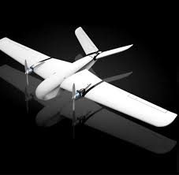

University of Hawaii Drone Technologies is a vertically integrated project made up of two divisions each consisting of multiple subsystems. The objective of this project is to reserach and develop technologies for different types of drones. The project has competed in the Annual Student Unmanned Aerial Systems Competition (SUAS) where the unmanned air vehicles (UAV) are expected to complete a set of challenges to score points in a competition style format.

As part of the image processing subsystem, I was in charge of creating data sets to train the alphanumeric recognition aspect of the simple neural network. With the help of the image processing lead, I was able to understand the fundamentals of the neural network which ran using Google's TensorFlow. Through the multiple datasets created and intensive training of the neural network, the a small digital camera mounted on the UAV was able to determine the shape of a board, the alphanumeric character printed on the board, the color of the board and the color of the alphanumeric character printed on the board with 83% accuracy, with the exception of green on grass.

You can find more information at the [University of Hawaii Drone Technology website](https://me.hawaii.edu/design/uhdt/) and the [Association for Unmanned Vehicle Systems International Website.](https://www.auvsi-suas.org/)
